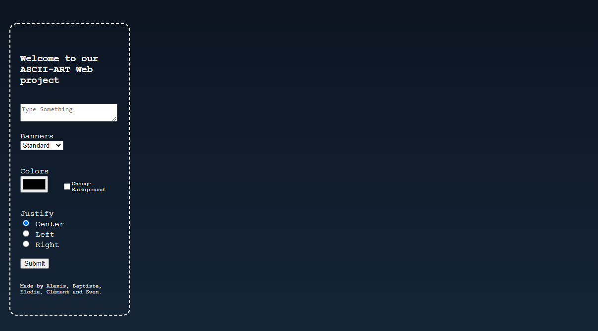
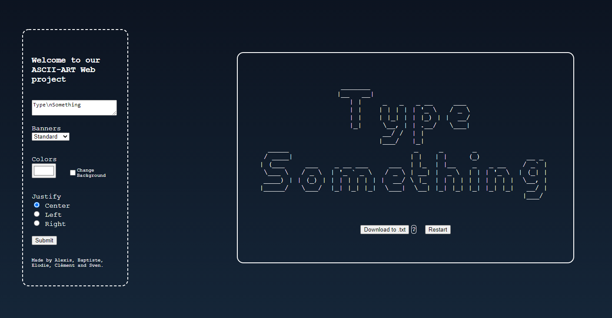

# <u><b>ASCII Art Web</b></u>

## Welcome to our Ascii Art Web project
Below, you will find a description of the project, the way to use it and examples.  

## What is the purpose of Ascii Art Web ?
The point of the project is to make a website where the user will write letters or words that will be displayed to him as a graphical representation of ASCII. As an exemple, here is the default values once you enter the website :
<pre>
                    _______                         
                   |__   __|                        
                      | |     _   _   _ __     ___  
                      | |    | | | | | '_ \   / _ \ 
                      | |    | |_| | | |_) | |  __/ 
                      |_|     \__, | | .__/   \___| 
                              __/ /  | |            
                             |___/   |_|            
  _____                              _     _       _                  
 / ____|                            | |   | |     (_)           __ _  
| (___     ___    _ __ ___     ___  | |_  | |__    _   _ __    / _` | 
 \___ \   / _ \  | '_ ` _ \   / _ \ | __| |  _ \  | | | '_ \  | (_| | 
 ____) | | (_) | | | | | | | |  __/ \ |_  | | | | | | | | | |  \__, | 
|_____/   \___/  |_| |_| |_|  \___|  \__| |_| |_| |_| |_| |_|   __/ | 
                                                               |___/  
                                                                      </pre> 

There are different exercices related to the project, such as letting the user choose the color for the Ascii representation.  We are giving the choice between eight different colors (White, Red, Green, Blue, Yellow, Cyan, Magenta and Black). For exemple here is the yellow color :
<pre style="color: yellow;">
 _______   _       _               _                      
|__   __| | |     (_)             (_)                     
   | |    | |__    _   ___         _   ___          __ _  
   | |    |  _ \  | | / __|       | | / __|        / _` | 
   | |    | | | | | | \__ \       | | \__ \       | (_| | 
   |_|    |_| |_| |_| |___/       |_| |___/        \__,_| 
                                                          
                                                          
__     __         _   _                            _______                 _    
\ \   / /        | | | |                          |__   __|               | |   
 \ \_/ /    ___  | | | |   ___   __      __          | |      ___  __  __ | |_  
  \   /    / _ \ | | | |  / _ \  \ \ /\ / /          | |     / _ \ \ \/ / | __| 
   | |    |  __/ | | | | | (_) |  \ V  V /           | |    |  __/  >  <  \ |_  
   |_|     \___| |_| |_|  \___/    \_/\_/            |_|     \___| /_/\_\  \__| 
                                                                                
                                                                                
                                                                        </pre> 

An another exercice is to use three banners to display texts. Banners are "Standard", "Shadow" and "Thinkertoy". If the user choose the "Thinkertoy" banner in our website, text will be printed with a style like :
<pre>                                                                               
o-O-o o           o             o                 o--o                         
  |   |    o      | /           |                 |   |                        
  |   O--o   o-o  OO   o-o o-o -o- o-o o  o       O--o   oo  o-o  o-o  o-o o-o 
  |   |  | | |  | | \  |-' |    |  | | |  |       |   | | |  |  | |  | |-' |   
  o   o  o | o  o o  o o-o o    o  o-o o--O       o--o  o-o- o  o o  o o-o o   
                                          |                                    
                                       o--o                                    </pre> 

You can also justify the text to the left, center or right. This option is only available when newlines (using "\n") are into the text. For exemple :

<pre>
                                                        _______   _       _        
                                                       |__   __| | |     (_)       
                                                          | |    | |__    _   ___  
                                                          | |    |  _ \  | | / __| 
                                                          | |    | | | | | | \__ \ 
                                                          |_|    |_| |_| |_| |___/ 
                                                                                   
                                                                                   
                                      _______                 _           _        
                                     |__   __|               | |         (_)       
                                        | |      ___  __  __ | |_         _   ___  
                                        | |     / _ \ \ \/ / | __|       | | / __| 
                                        | |    |  __/  >  <  \ |_        | | \__ \ 
                                        |_|     \___| /_/\_\  \__|       |_| |___/ 
                                                                                   
                                                                                   
                               _                 _     _    __   _              _  
                              | |               | |   (_)  / _| (_)            | | 
                              | |  _   _   ___  | |_   _  | |_   _    ___    __| | 
                          _   | | | | | | / __| | __| | | |  _| | |  / _ \  / _` | 
                         | |__| | | |_| | \__ \ \ |_  | | | |   | | |  __/ | (_| | 
                          \____/   \__,_| |___/  \__| |_| |_|   |_|  \___|  \__,_| 
                                                                                   
                                                                                   
  ____                  _     _                           _           _       _    
 / __ \                | |   | |                         (_)   __ _  | |     | |   
| |  | |  _ __         | |_  | |__     ___         _ __   _   / _` | | |__   | |_  
| |  | | | '_ \        | __| |  _ \   / _ \       | '__| | | | (_| | |  _ \  | __| 
| |__| | | | | |       \ |_  | | | | |  __/       | |    | |  \__, | | | | | \ |_  
 \____/  |_| |_|        \__| |_| |_|  \___|       |_|    |_|   __/ | |_| |_|  \__| 
                                                              |___/                
                                                                                   </pre> 

Finally, the user have the possibility to download the Ascii representation of the text by simply cliking the button below the result. It will be downloaded as a .txt file.  However, .txt file does not support colors and justify texts.  

=================================================================  

## How to use the website

Once you are connected to the website, the main page looks minimal.  In the middle of the screen, you'll find every values you can modify :  
  

Once you entered your text and choose everything you want, press the Submit button so the program takes every values. 
As a result, you will redirected to the page with the form on the left and the Ascii representation on the right :
  
To download, simply press the "Download to .txt" button.

=================================================================  

## Team

Initials | First Name
------------ | -------------
ESENEL | Elodie
AVELLEINE | Alexis
SDOCKX | Sven
BBOUQUIER | Baptiste
CROC | Clément